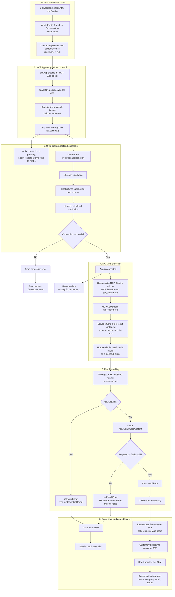

# React and MCP App flow diagrams

Quick-reference diagrams extracted from `REACT_README.md`.

This flowchart emphasizes UI states, decisions, and error branches. For actor ownership, protocol boundaries, and
message order, see [`REACT_FLOW_SEQUENCE_DIAGRAM.md`](./REACT_FLOW_SEQUENCE_DIAGRAM.md).

## Connection boundaries

There are two separate connections:

```text
MCP App UI (inside an iframe)
        |
        | MCP Apps JSON-RPC over browser postMessage
        v
MCP host
        |
        | MCP protocol: tool and resource requests
        v
MCP server
```

The iframe UI connects to the host. It does not connect directly to the MCP server.

## Happy path

```text
1. React renders CustomerApp with customer = null.
2. useApp creates the MCP App object.
3. onAppCreated registers the toolresult listener.
4. useApp connects the iframe UI to the MCP host.
5. Host uses its MCP Client to ask the MCP Server to run get_customer().
6. MCP Server returns a tool result containing structuredContent.
7. Host sends the result to the iframe as a toolresult event.
8. The registered JavaScript handler validates result.structuredContent.
9. The handler calls setCustomer(data).
10. React calls CustomerApp again and updates the screen.
```

## Consolidated detailed flow

This diagram combines application startup, the MCP Apps handshake, tool execution, event timing, result validation,
React state changes, and every resulting UI state.



### Why listener timing matters

```text
Safe:  register listener -> connect -> receive initial result
Risky: connect -> initial result arrives -> register listener too late
```

The diagram follows the safe order. `onAppCreated` installs the listener before `useApp` connects because the host may
send the initial result as soon as the connection is ready.

### Covered use cases

- Initial page and React startup
- MCP App creation and safe listener registration
- UI-to-host connection handshake
- Connection-pending UI
- Connection failure
- Connected UI waiting for a result
- Host-to-server tool execution and result delivery
- Exact `get_customer()` request and server execution responsibilities
- Correct listener timing and the missed-event risk
- Tool-reported failure
- Missing or invalid `structuredContent`
- `setCustomer(data)`, React re-rendering, DOM update, and successful customer display
