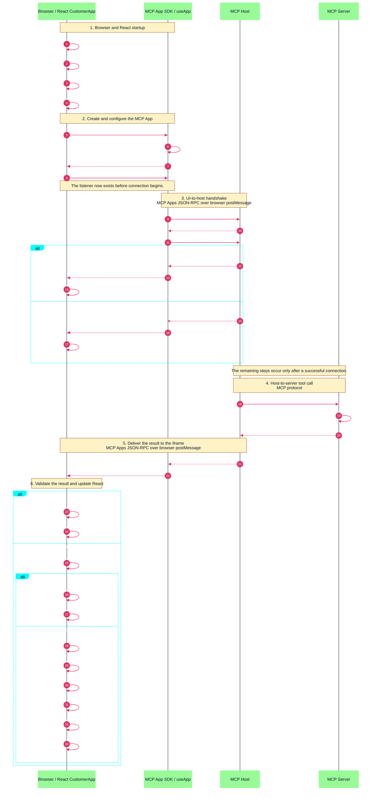
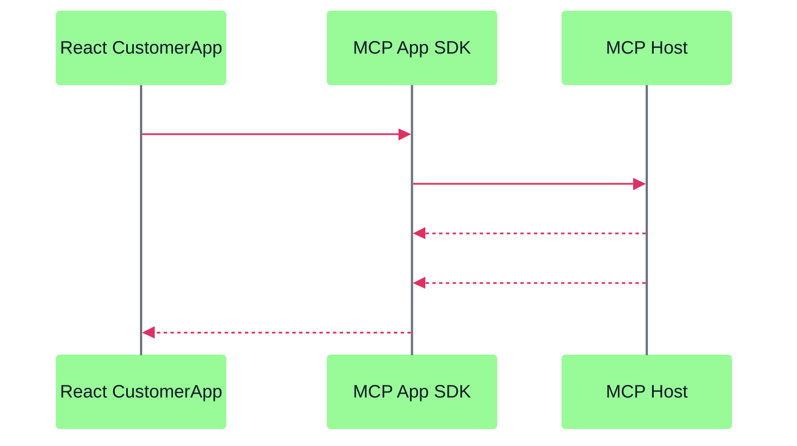
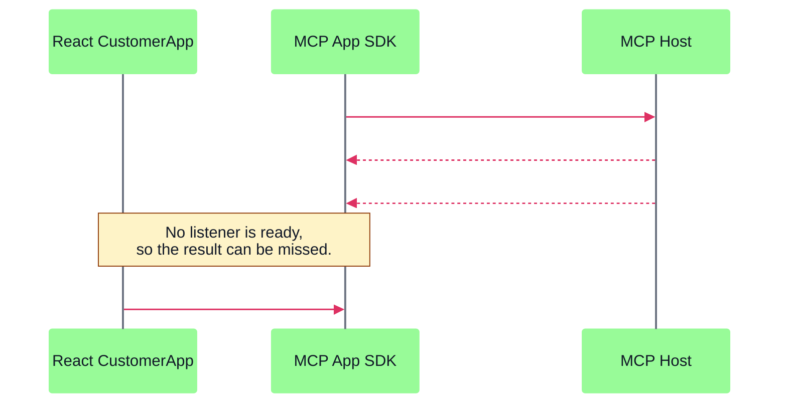

# React and MCP App complete sequence

Use this diagram to answer two questions:

1. Which component performs each step?
2. In what order do messages move between the iframe, host, and server?

For application states and decision branches, see
[`REACT_FLOW_DIAGRAMS_CONSOLIDATED.md`](./REACT_FLOW_DIAGRAMS_CONSOLIDATED.md).

## Participants

| Participant     | Responsibility                                                                                    |
|-----------------|---------------------------------------------------------------------------------------------------|
| Browser / React | Render `CustomerApp`, store customer state, and update the DOM.                                   |
| MCP App SDK     | Create the `App`, connect the iframe to the host, and deliver host events to registered handlers. |
| MCP Host        | Own the iframe, communicate with the UI, and use its MCP Client to call the MCP server.           |
| MCP Server      | Run `get_customer()` and return the tool result.                                                  |

The browser UI does not connect directly to the MCP server.

## Complete runtime sequence

The sequence diagrams use a fixed light theme with dark text so their contrast does not depend on the viewer's theme.

## Why listener timing matters

The complete sequence uses the safe order:

The risky order can miss the initial result:

Register the listener inside `onAppCreated`. This callback runs after the `App` object is created and before `useApp`
connects it to the host.
